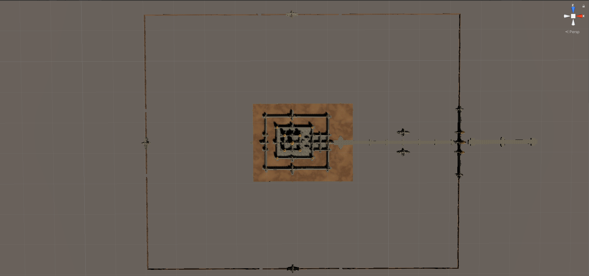
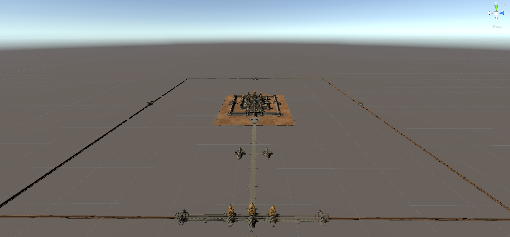
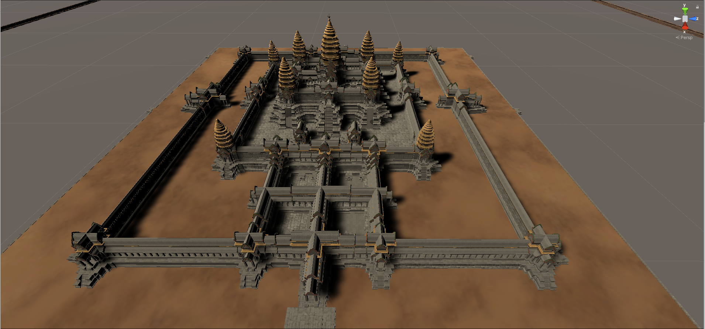
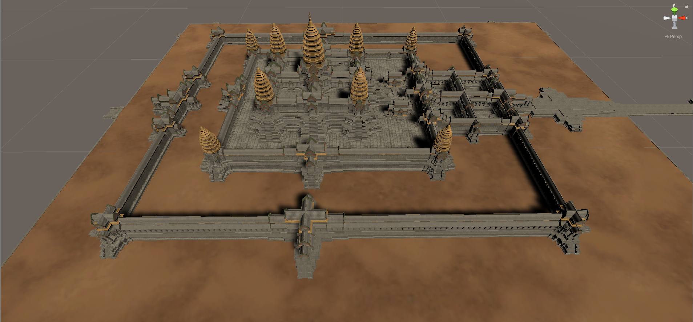

# Weekly Blog Post One: Environment Construction

For the past weeks, I have been working on the construction of the base environment where animations and interactions will be implemented. With the help from [Virtual Angkor Project](https://www.virtualangkor.com/), I was able to obtain the 3D model of Angkor Wat and its corresponding textures, as shown in the screenshots below. 

*Top view*

*Front view*

*Closer front view*

*Side view*
