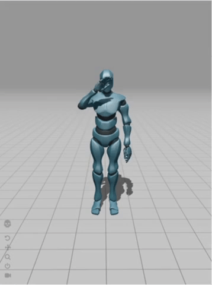
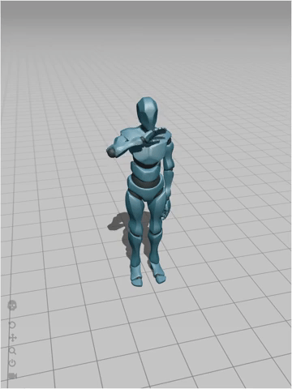
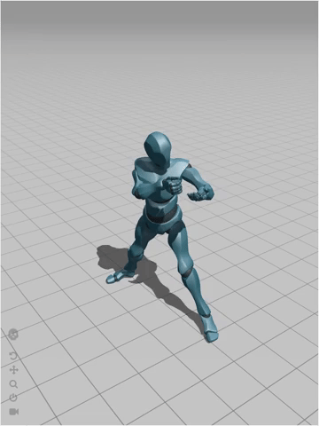

# Weekly Blog Post Two: Creating Characters

I have been using Maya to model 3D characters. The current characters that I am working on are an avarta of me and a soldier.

## My Avarta

### Soldier

I also started to implement animations into these 3D models, so I can add them to my scenes in Unity.

*Waving animation for my avartar*

*Waving animation for my avartar*

*Soldier's shooting animation*

