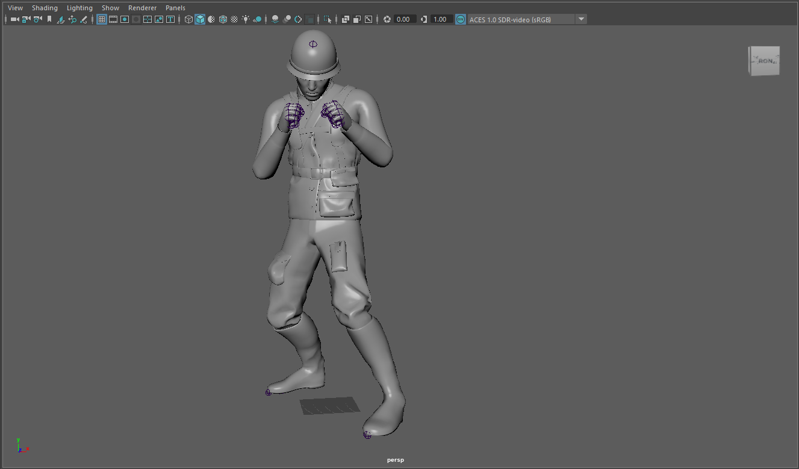
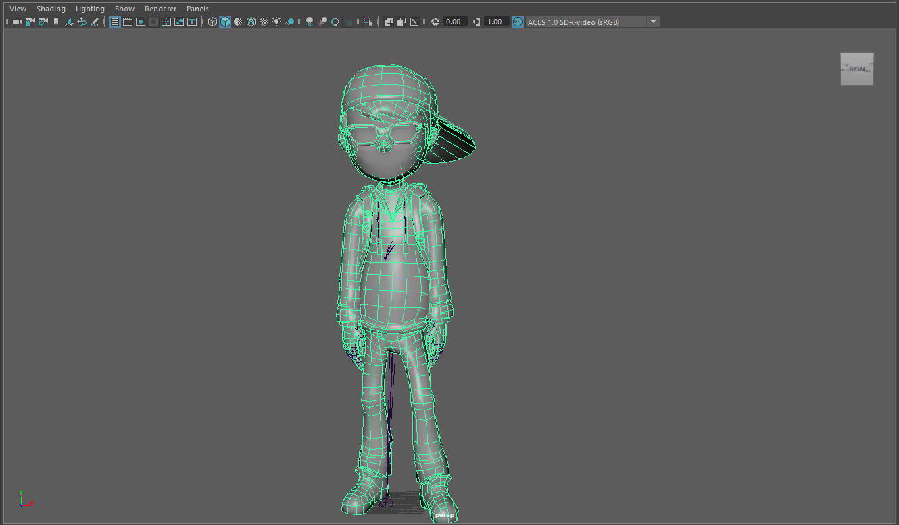
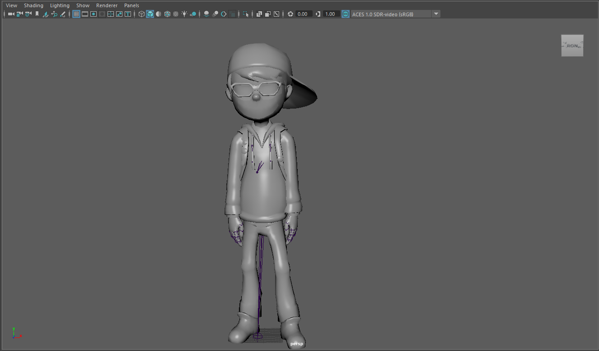

# Weekly Blog Post Two: Creating Characters

I have been using Maya to model 3D characters. The current characters that I am working on are an avarta of me and a soldier.

### Soldier

## My Avarta

